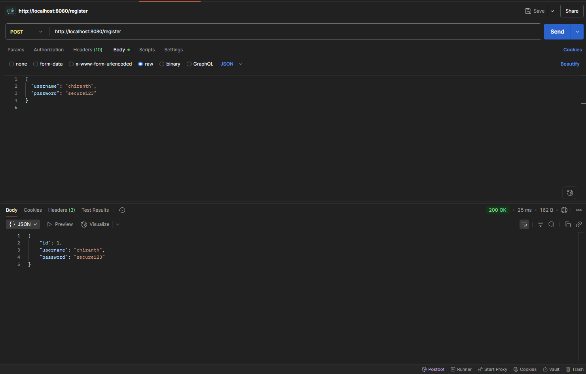
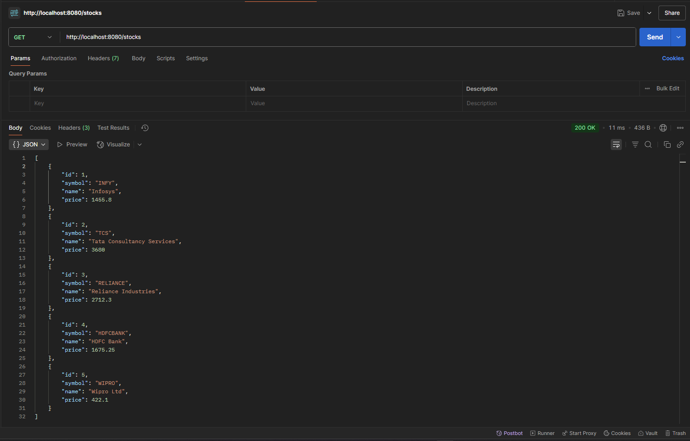
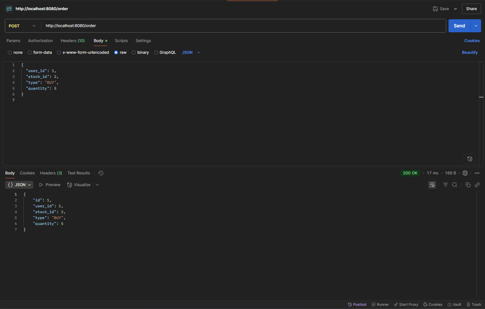
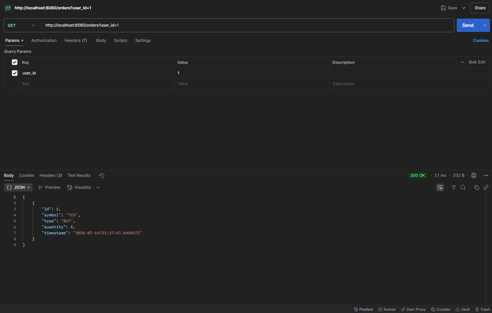
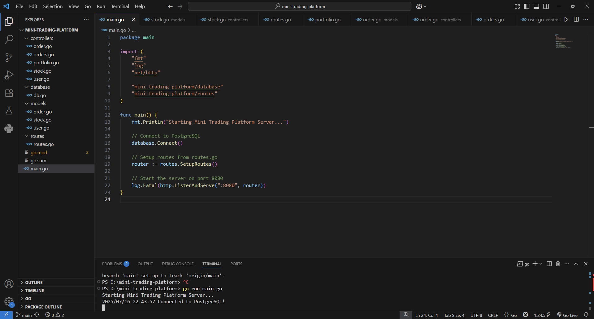

💹 Mini Trading Platform Backend – Golang + PostgreSQL

A backend-only mock trading platform that lets users register, view stocks, place buy/sell orders, and view portfolios — built with Golang and PostgreSQL.

---

🚀 Features

- ✅ User Registration (`/register`)
- 📈 View available stocks (`/stocks`)
- 💸 Place BUY/SELL trades (`/order`)
- 🧾 View trade history (`/orders`)
- 📊 Portfolio calculation (`/portfolio`)

---

🛠 Tech Stack

- **Backend**: Golang
- **Database**: PostgreSQL
- **Libraries**: Gorilla Mux, lib/pq
- **Tools**: Postman, TablePlus, VS Code

---

📂 Folder Structure

mini-trading-platform/
├── controllers/
├── database/
├── models/
├── routes/
├── main.go
├── go.mod

---

📦 API Endpoints

| Method | Endpoint      | Description                     |
|--------|---------------|---------------------------------|
| POST   | /register     | Register a new user             |
| GET    | /stocks       | View all available stocks       |
| POST   | /order        | Place a BUY or SELL order       |
| GET    | /orders       | View all trades by user         |
| GET    | /portfolio    | View current portfolio summary  |

---

🧪 How to Run Locally

git clone https://github.com/Chiranth0722/mini-trading-platform.git
cd mini-trading-platform
go mod tidy
go run main.go

📸 Screenshots 

1. User Registration (POST `/register`)

2. View All Stocks (GET `/stocks`)

3. Place an Order (POST `/order`)

4. View Portfolio (GET `/portfolio`)

5. View Order History (GET `/orders`)

6. VS Code – Project Folder Structure

🌐 Frontend + Deployment (Coming Soon...)
✅ Backend hosted on Render/Railway

🎨 Frontend site built with React

🔗 Live links and frontend repo to be added

👤 Author
Chiranth K K
Backend Developer | Golang + PostgreSQL
